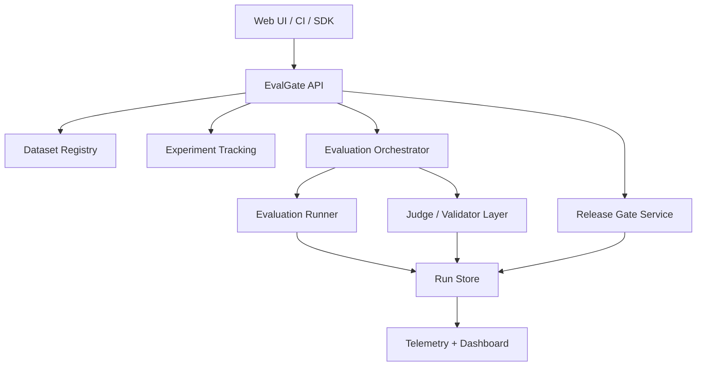

# EvalGate Architecture

`EvalForge` is the current working implementation. `EvalGate` is the target platform architecture it is evolving toward: a multi-team LLM evaluation and release-gating system.

## Current Gaps

- Async execution is persisted but still processed in-process via FastAPI background tasks.
- Evaluation runs are tracked, but experiment metadata and release decisions were limited before the latest upgrade.
- The platform has no auth, tenant isolation, or CI-integrated gating workflow yet.
- Evaluator coverage is still focused on rubric scoring, pairwise comparison, and judge scoring rather than a full evaluator registry.

## Target Platform

## Core Platform Modules

### Dataset Registry
- Immutable dataset versions
- Scenario and slice tagging
- Adversarial benchmark suites
- Ownership and approval status

### Experiment Tracking
- Prompt version
- Model version
- Evaluator version
- Experiment name
- Run metadata and reproducibility fields

### Evaluation Framework
- Rubric scoring
- Pairwise comparison
- Judge-based evaluation
- Structured output validation
- Hallucination and groundedness checks

### Release Gating
- Baseline vs candidate comparison
- Threshold policies on score, latency, cost, and failed cases
- Persisted release decisions
- CI/CD friendly decision API

### Dashboard and Telemetry
- Aggregate score trends
- Cost and latency reporting
- Async job state visibility
- Release gate history

## Release Gate Methodology

Each candidate run is compared against a baseline run for the same dataset. The current implementation computes:

- `score_delta`
- `latency_delta_ms`
- `cost_delta_usd`
- `failed_case_delta`

The gate fails if any configured threshold is exceeded.

## Near-Term Upgrades

1. Replace FastAPI background tasks with a durable worker queue.
2. Add evaluator registry and scenario-level score rollups.
3. Add auth and workspace boundaries.
4. Add CI integration for release promotion decisions.
5. Add a trained quality model to complement judge scoring.

## Why This Matters

The value of `EvalGate` is not just evaluating prompts. It creates a release decision layer for LLM systems:

- Is the candidate prompt or model better than the approved baseline?
- Is it cheaper?
- Is it slower?
- Did it regress on critical scenarios?
- Should it be promoted to production?
