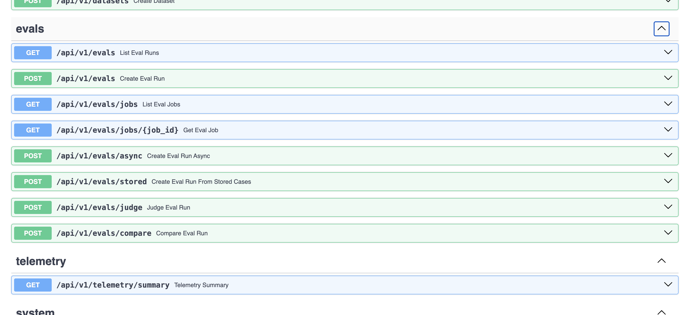
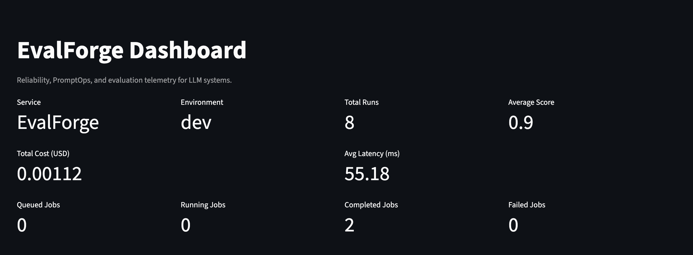
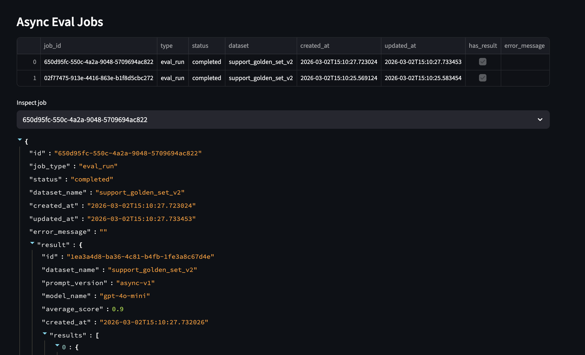

# EvalForge

EvalForge is a production-style LLM Reliability and PromptOps platform for regression testing prompts, scoring model outputs, comparing prompt versions, managing golden datasets, and monitoring latency, cost, and async evaluation jobs.

## Why this project matters

Teams shipping LLM features usually fail on the same problems:

- prompt changes silently degrade quality
- there is no reusable golden dataset for regression checks
- evaluation logic is inconsistent across teams
- latency and cost are not tracked with output quality
- failures are only discovered after deployment

EvalForge addresses that by combining:

- FastAPI evaluation APIs
- persistent dataset, run, and asset management
- heuristic and LLM-judge scoring
- prompt template and golden case versioning
- async job submission and polling
- dashboard observability

## Key capabilities

- Golden dataset management with stored prompt templates and golden cases
- Synchronous eval runs for quick iteration
- Async eval jobs for background processing and job polling
- Pairwise comparison for prompt or response variants
- Judge-based scoring with structured OpenAI-compatible output and fallback
- Bundle import/export for dataset portability
- Telemetry for average score, latency, and cost
- Streamlit dashboard for runs, jobs, prompts, and golden assets

## Architecture

```text
                      +----------------------+
                      |  Streamlit Dashboard |
                      +----------+-----------+
                                 |
                                 v
+-----------+          +---------+----------+         +------------------+
| Swagger UI | ------> |      FastAPI       | ------> |  Telemetry APIs  |
+-----------+          |  evals / assets    |         +------------------+
                       |  jobs / datasets   |
                       +----+-----------+---+
                            |           |
                            |           +-------------------------------+
                            |                                           |
                            v                                           v
                   +--------+---------+                     +-----------+-----------+
                   |   Eval Engine    |                     |  Judge Engine         |
                   | heuristic scorer |                     | mock / OpenAI-style   |
                   +--------+---------+                     +-----------+-----------+
                            |                                           |
                            +------------------+------------------------+
                                               |
                                               v
                                   +-----------+-----------+
                                   |  SQLAlchemy Storage   |
                                   | runs / jobs / assets  |
                                   +-----------+-----------+
                                               |
                                               v
                                        SQLite or Postgres
```

## Screenshots

### API endpoints



### Dashboard overview



### Async jobs



## Stack

- Backend: FastAPI, Pydantic, SQLAlchemy
- Storage: SQLite by default, Postgres-ready config, Alembic migrations
- LLM judge: OpenAI-compatible structured `chat/completions` path with fallback
- Dashboard: Streamlit, pandas
- Async processing: local background execution by default, Redis-backed worker path for durable job dispatch
- Packaging: editable Python package with `pyproject.toml`

## Project structure

```text
evalforge/
├── app/
│   ├── api/routes/
│   ├── core/
│   ├── db/
│   ├── engine/
│   ├── models/
│   └── services/
├── dashboard/
├── training/
├── tests/
├── alembic/
├── docker-compose.yml
├── Dockerfile
├── alembic.ini
└── README.md
```

## Quick start

```bash
cd evalforge
python3 -m venv .venv
source .venv/bin/activate
pip install --upgrade pip
pip install -e '.[dev]'
```

Create or update `.env`:

```env
DATABASE_URL=sqlite:///./evalforge.db
AUTO_CREATE_TABLES=true
JUDGE_PROVIDER=mock
OPENAI_API_KEY=
OPENAI_BASE_URL=https://api.openai.com/v1
JUDGE_MODEL=gpt-4o-mini
ASYNC_BACKEND=local
REDIS_URL=redis://localhost:6379/0
REDIS_QUEUE_NAME=evalforge:eval_jobs
PLATFORM_API_KEY=
DEFAULT_WORKSPACE_ID=default
```

Start the API:

```bash
python -m uvicorn app.main:app --port 8001
```

Open Swagger:

- [http://127.0.0.1:8001/docs](http://127.0.0.1:8001/docs)

Start the dashboard in a second terminal:

```bash
cd evalforge
source .venv/bin/activate
streamlit run dashboard/app.py --server.port 8502
```

Open dashboard:

- [http://localhost:8502](http://localhost:8502)

Set sidebar API URL to:

```text
http://127.0.0.1:8001
```

If API key protection is enabled, also set:

- `API Key`: your configured `PLATFORM_API_KEY`
- `Workspace`: your target workspace, for example `default` or `team-a`

## Main API surface

- `GET /health`
- `GET /api/v1/datasets`
- `POST /api/v1/datasets`
- `GET /api/v1/assets/prompts`
- `POST /api/v1/assets/prompts`
- `GET /api/v1/assets/golden-cases`
- `POST /api/v1/assets/golden-cases`
- `GET /api/v1/assets/bundles/{dataset_name}`
- `POST /api/v1/assets/bundles/import`
- `GET /api/v1/evals`
- `POST /api/v1/evals`
- `POST /api/v1/evals/async`
- `GET /api/v1/evals/jobs`
- `GET /api/v1/evals/jobs/{job_id}`
- `POST /api/v1/evals/stored`
- `POST /api/v1/evals/judge`
- `POST /api/v1/evals/compare`
- `GET /api/v1/release-gates`
- `POST /api/v1/release-gates`
- `POST /api/v1/release-gates/evaluate-latest`
- `GET /api/v1/release-gates/summary`
- `GET /api/v1/release-gates/ci-decision`
- `GET /api/v1/release-gates/trends`
- `GET /api/v1/telemetry/summary`

## API protection and workspaces

EvalForge now supports a minimal platform-style access model:

- optional API-key enforcement
- workspace-scoped datasets, runs, jobs, telemetry, and release gates

Enable API-key enforcement:

```env
PLATFORM_API_KEY=change-me
DEFAULT_WORKSPACE_ID=default
```

Then send headers with requests:

```text
X-API-Key: change-me
X-Workspace-ID: team-a
```

Behavior:

- if `PLATFORM_API_KEY` is empty, auth is disabled
- if `X-Workspace-ID` is omitted, `DEFAULT_WORKSPACE_ID` is used
- workspace scoping applies to newly created datasets and evaluation artifacts

## CI release gate workflow

This repo includes a GitHub Actions workflow:

- `.github/workflows/release-gate-ci.yml`

It queries:

- `GET /api/v1/release-gates/ci-decision`

and fails the workflow when `allow_deploy=false`.

Configure repository **Variables**:

- `EVALFORGE_API_URL` (example: `https://your-api-domain`)
- `EVALFORGE_DATASET` (target dataset name)
- `EVALFORGE_EXPERIMENT` (optional)
- `EVALFORGE_WORKSPACE` (optional)
- `EVALFORGE_REQUIRE_GATE_DECISION` (`true` by default)

Configure repository **Secret**:

- `EVALFORGE_API_KEY` (optional unless API key protection is enabled)

Local dry-run (without calling API) for CI decision payloads:

```bash
python scripts/ci/check_release_gate.py --input-file /path/to/decision.json
```

## Demo flow

For a clean demo, use this order:

1. Create a dataset with `POST /api/v1/datasets`
2. Add a prompt template with `POST /api/v1/assets/prompts`
3. Add a golden case with `POST /api/v1/assets/golden-cases`
4. Run `POST /api/v1/evals/stored`
5. Run `POST /api/v1/evals/compare`
6. Run `POST /api/v1/evals/judge`
7. Run `POST /api/v1/evals/async`
8. Poll `GET /api/v1/evals/jobs/{job_id}`
9. Open the dashboard and show Runs + Jobs + Telemetry

## Judge modes

### Mock mode

Use deterministic local scoring:

```env
JUDGE_PROVIDER=mock
```

### OpenAI-compatible structured judge

```env
JUDGE_PROVIDER=openai
OPENAI_API_KEY=your_key_here
OPENAI_BASE_URL=https://api.openai.com/v1
JUDGE_MODEL=gpt-4o-mini
```

Behavior:

- sends a structured JSON-schema scoring request to `/chat/completions`
- parses score, pass/fail, matched terms, missing terms, criterion scores, and reasoning
- falls back to the mock judge if the key is missing, the provider is unavailable, or the response is malformed
- marks fallback responses with `used_fallback=true`

## Async jobs

EvalForge supports background eval execution with persisted job state.

Job lifecycle:

- `queued`
- `running`
- `completed`
- `failed`

The dashboard surfaces:

- queued job count
- running job count
- completed job count
- failed job count
- per-job result payloads

### Local mode

Default local mode executes jobs with FastAPI background execution:

```env
ASYNC_BACKEND=local
```

### Redis-backed durable mode

Enable Redis-backed dispatch:

```env
ASYNC_BACKEND=redis
REDIS_URL=redis://localhost:6379/0
REDIS_QUEUE_NAME=evalforge:eval_jobs
```

Run the worker:

```bash
python -m app.workers.redis_worker
```

## Dataset portability

Bundles let you move a dataset and its assets together:

- dataset record
- prompt templates
- golden cases

Use:

- `GET /api/v1/assets/bundles/{dataset_name}`
- `POST /api/v1/assets/bundles/import`

## Postgres, Redis, and Alembic

The repo includes Alembic plus a Docker Compose stack for:

- Postgres
- Redis
- API
- worker

Local SQLite is still the default path for quick development.

Install dependencies:

```bash
cd evalforge
source .venv/bin/activate
pip install -e '.[dev]'
```

Run migrations against the current database target:

```bash
alembic upgrade head
```

For Postgres later, switch `.env` to a Postgres URL and set:

```env
AUTO_CREATE_TABLES=false
```
