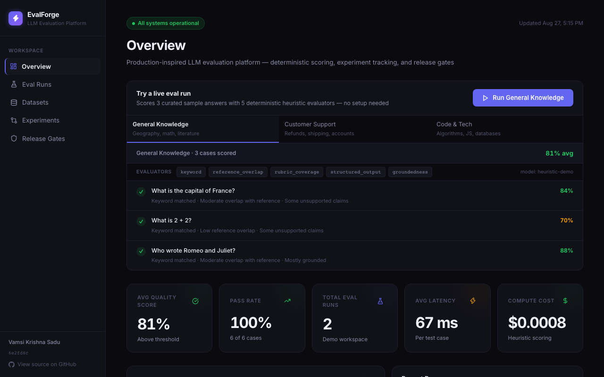

# EvalForge

[](https://github.com/vamsi513/evalforge/actions/workflows/ci.yml)


A production-inspired LLM evaluation platform with deterministic multi-signal scoring, experiment tracking, and automated release gates. Built with FastAPI, Next.js 16, and SQLAlchemy — deployed on AWS EC2 and Vercel.

## Live Demo

**Dashboard:** [https://evalforge-platform.vercel.app](https://evalforge-platform.vercel.app)

**API docs:** [http://23.21.42.197:8001/docs](http://23.21.42.197:8001/docs)

Click **Run General Knowledge** on the dashboard to run a live heuristic evaluation — no setup needed. The demo runs in `mock` judge mode (see [Judge modes](#judge-modes) below), so the compute cost shown is genuinely `$0.0000` — no LLM judge API call is made, only the deterministic scorers.



## What it does

Teams shipping LLM features hit the same problems:

- prompt changes silently degrade output quality
- no reusable golden dataset for regression testing
- evaluation logic is inconsistent across teams
- latency and cost are untracked
- failures surface only after deployment

EvalForge addresses this with a full evaluation pipeline:

- **5-signal heuristic scorer** — keyword match, reference overlap, rubric coverage, structured output validation, lexical groundedness
- **LLM judge adapters** — OpenAI, Anthropic, Mistral via a unified interface with automatic heuristic fallback
- **Experiment leaderboard** — rank prompt versions and model configs by average eval score
- **Release gates** — PASS/FAIL CI signal based on score delta vs. baseline
- **Async job worker** — background eval jobs off the request/response cycle; runs in-process by default (`ASYNC_BACKEND=local`, what the live deployment uses today), with a Redis-backed queue available via `ASYNC_BACKEND=redis` for true multi-process decoupling
- **Telemetry** — per-run latency, cost, pass rate, and groundedness metrics

## Stack

| Layer | Technology |
|---|---|
| Backend API | FastAPI, Pydantic, SQLAlchemy |
| Storage | SQLite (default), Postgres-ready, Alembic migrations |
| LLM judges | OpenAI · Anthropic · Mistral with heuristic fallback |
| Experiment tracking | MLflow — every eval run and pairwise comparison logged automatically (params, metrics, results artifact) |
| Async jobs | In-process by default (`ASYNC_BACKEND=local`); Redis-backed queue available for true decoupling |
| Frontend | Next.js 16 App Router, React, Vercel |
| Infrastructure | Docker, GitHub Actions CI/CD, AWS EC2 |

## Architecture

```text
┌─────────────────────────┐
│  Next.js 16 Dashboard   │  ← evalforge-platform.vercel.app
│  (Vercel)               │
└────────────┬────────────┘
             │ HTTPS (server-side proxy)
             ▼
┌────────────────────────────────────────────┐
│              FastAPI Backend               │  ← EC2 :8001
│  /evals  /experiments  /release-gates      │
│  /datasets  /telemetry  /evals/async       │
└──────┬─────────────────────────┬───────────┘
       │                         │
       ▼                         ▼
┌──────────────┐       ┌─────────────────────┐
│  Eval Engine │       │    Judge Engine      │
│  heuristic   │       │  OpenAI / Anthropic  │
│  5-signal    │       │  Mistral / fallback  │
└──────┬───────┘       └──────────┬──────────┘
       └──────────────┬───────────┘
                      ▼
             ┌────────────────┐
             │  SQLAlchemy    │
             │  SQLite / PG   │
             └────────────────┘
```

## Project structure

```text
evalforge/
├── app/                    # FastAPI backend
│   ├── api/routes/         # Evals, experiments, gates, telemetry
│   ├── engine/judge.py     # Heuristic + LLM judge scorers
│   ├── models/             # Pydantic schemas
│   └── services/           # Business logic
├── frontend/               # Next.js 16 dashboard
│   ├── app/                # App Router pages + loading skeletons
│   ├── components/         # MetricCard, ScoreChart, DemoButton…
│   └── lib/api.ts          # Typed API client
├── tests/
├── alembic/                # DB migrations
├── docker-compose.yml
└── Dockerfile
```

## Quick start

```bash
python3 -m venv .venv && source .venv/bin/activate
pip install -e '.[dev]'
```

Create `.env`:

```env
DATABASE_URL=sqlite:///./evalforge.db
AUTO_CREATE_TABLES=true
JUDGE_PROVIDER=mock
OPENAI_API_KEY=
JUDGE_MODEL=gpt-4o-mini
PLATFORM_API_KEY=
DEFAULT_WORKSPACE_ID=default
```

Start the API:

```bash
uvicorn app.main:app --port 8001
```

Start the frontend:

```bash
cd frontend && npm install && npm run dev
```

## Judge modes

| Provider | Description |
|---|---|
| `mock` | Deterministic heuristic scoring — no API key, zero cost, fast CI |
| `openai` | OpenAI structured judge via `/chat/completions` with JSON schema output |
| `anthropic` | Anthropic Messages API judge |
| `mistral` | Mistral client judge |

All providers fall back to `mock` if the key is missing or the response is malformed. Fallback responses are marked with `used_fallback=true`.

### Judge provider benchmark

Measured against a 30-case evaluation set (`evaluation/judge_benchmark_dataset.json` — 10 cases each across general knowledge, customer support, and code/tech, with deliberately mixed answer quality so scores actually differentiate). Every number below is a real per-request measurement — latency is wall-clock time around the actual API call, cost is computed from real token usage against the published per-token pricing in `app/engine/judge.py`. Reproduce with:

```bash
python -m scripts.run_judge_benchmark --out results.json
```

| Provider | Model | Latency (min/max/avg) | Cost per call (min/max/avg) | Total cost (30 calls) | Avg score |
|---|---|---|---|---|---|
| OpenAI | gpt-4o-mini | 909 / 2161 / 1177 ms | $0.000094 / $0.000134 / $0.000112 | $0.003363 | 0.687 |
| Anthropic | claude-haiku-4-5 | 2829 / 4791 / 3952 ms | $0.002746 / $0.003349 / $0.003050 | $0.091500 | 0.674 |
| Mistral | mistral-small-latest | 1089 / 2744 / 1668 ms | $0.000055 / $0.000097 / $0.000080 | $0.002387 | 0.648 |

Total real spend for this benchmark: **$0.097250** (90 calls).

Anthropic's claude-haiku-4-5 was consistently the slowest and, by a wide margin, the most expensive per call — roughly 27x OpenAI's and 38x Mistral's average cost on this dataset, consistent with its higher published per-token pricing on both prompt and completion tokens. Mistral had the lowest per-call cost and fastest median response, though its API rate-limits more aggressively under back-to-back requests than the other two — `scripts/run_judge_benchmark.py` paces and retries automatically when that happens rather than reporting a rate-limited fallback as a real result.

30 cases is not a large-scale benchmark; treat the average-score column as a rough signal on this specific dataset, not a general quality ranking of the three models.

## Evaluator profiles

`POST /api/v1/evals` accepts `evaluator_profile`: `strict` | `balanced` | `lenient`

Profiles weight keyword hit, reference overlap, rubric coverage, structured output validity, and lexical groundedness differently.

## Async jobs

Background eval execution with persisted job state (`queued → running → completed → failed`).

```bash
# Redis-backed worker
ASYNC_BACKEND=redis
python -m app.workers.redis_worker
```

## CI/CD

Every push to `main`:

1. Ruff lint + security scan
2. Docker build
3. Full test suite
4. SSH deploy to EC2 — rebuild and restart container
5. Health check loop with automatic rollback on failure

Release gate CI workflow queries `GET /api/v1/release-gates/ci-decision` and fails the pipeline when `allow_deploy=false`.

## API surface

```
GET  /health
POST /api/v1/datasets
POST /api/v1/evals
POST /api/v1/evals/async
GET  /api/v1/evals/jobs/{job_id}
POST /api/v1/experiments
GET  /api/v1/experiments/leaderboard
POST /api/v1/release-gates
GET  /api/v1/release-gates/ci-decision
GET  /api/v1/telemetry/summary
```

Full reference: [http://23.21.42.197:8001/docs](http://23.21.42.197:8001/docs)

## License

MIT
