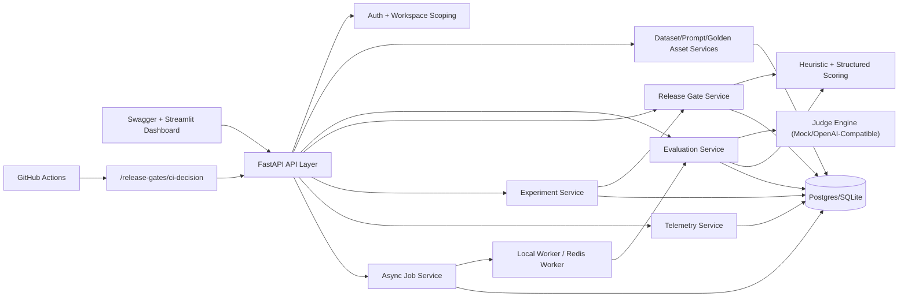

# EvalForge Architecture Diagram

## System Diagram

## Key Design Decisions

- Service-oriented backend modules isolate asset management, evaluation, telemetry, and release policy logic.
- Evaluation supports sync and async entry points so teams can run interactive checks and batch regressions.
- Judge scoring is provider-agnostic with deterministic fallback to reduce pipeline brittleness.
- Release gates convert evaluation signals into deploy decisions consumable by CI pipelines.
- Workspace-aware auth allows one platform to support multiple teams with scoped data.

## Scale Path

- Move to managed Postgres and Redis for durability.
- Run dedicated worker replicas for async eval throughput.
- Add queue priority and retry policies for long-running judge calls.
- Add OpenTelemetry export and dashboard alerts for SLO enforcement.
